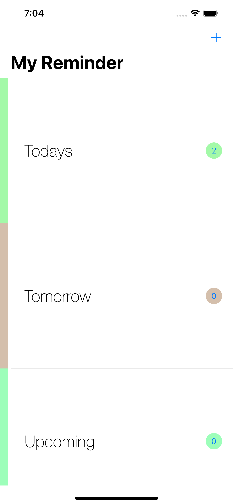
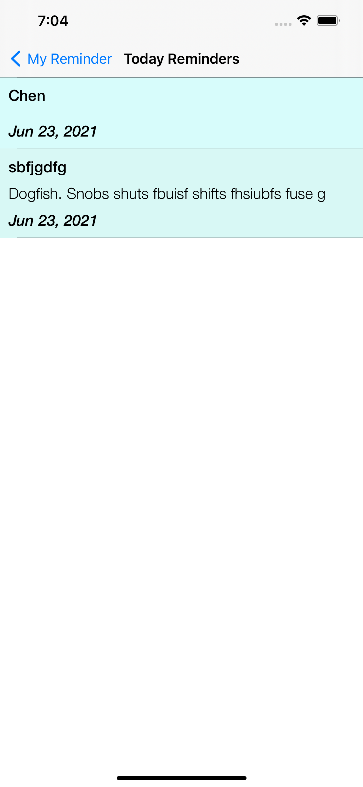
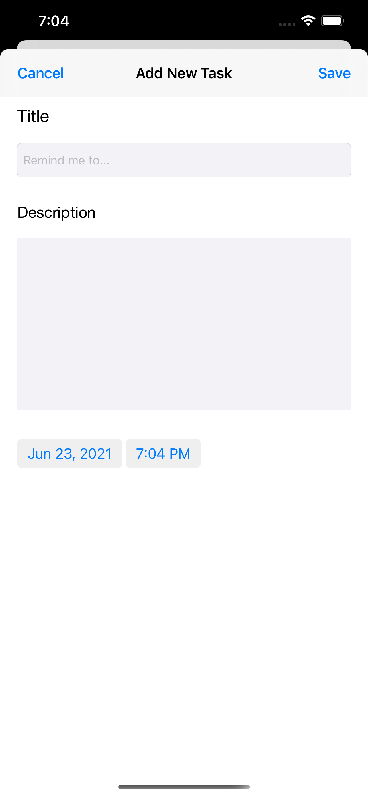

# DemoApp1
ToDo List App

## Requirements

- Swift 5.0
- Xcode 12 or greater
- iOS 13.0 or greater

## Installation

### CocoaPods
1- IQKeyboardManagerSwift

## Usage
- User can to do task as per daily / next day or upcoming event
- Those are event will be added to calender app
- User can mark complete by swipe action on list screen of section wise task list

App UI

1- Main Screen

2- Section wise list screen

3- Add Item screen

## Author
- LinkedIn:[@Dinesh](https://www.linkedin.com/in/idktanwar/)
- Gtihub [@Dinesh](https://github.com/idktanwar/)

## License
@copyright dk@2021
